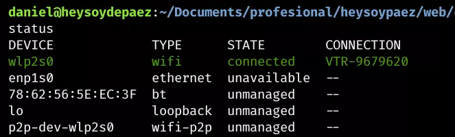

> “La filosofía de Linux es ‘Ríete en la cara del peligro’. Ups, no. ‘Hazlo tú mismo’. Sí, eso es.” - [Linus Torvalds](https://es.wikipedia.org/wiki/Linus_Torvalds)

Me gusta Linux porque me hace sufrir.

Y cuando sufres te haces más fuerte, **porque lo no te mata te hace más fuerte.**

Por ejemplo, si quieres escuchar música con Bluetooth con unos audifonos raros **no puedes**, porque el driver no está correctamente configurado.

_O aprendes como solucionarlo o te jodes._

Me sucedió eso con el problema de conectarme a internet a través de Ethernet.

<figure>
	
	<figcaption>En linux lo que no te mata te hace mas fuerte.</figcaption>
</figure>

## El problema.

Necesito conectarme a Ethernet en mi computador Lubuntu, que es una subversión ligera de Ubuntu.

Cuando conecto un cable Ethernet con conexión no sucede absolutamente nada.

## La solución.

### Revisa el estado actual de tu conexión de Ethernet.

En mi caso al momento de verlo me salia desactivado "disabled".

Para ello usa el comando:

```
sudo lshw -C network
```

Y verás algo como esto:


Por lo tanto, la solución en mi caso fue encontrar donde diablos estaba el "botón" para activar el Ethernet.

## El "botón" en la terminal para activar la ethernet.

Para resumir la historia descubrí que a través del siguiente comando veía de nuevo, en otro formato más limpio el estado de mis redes.

```
nmcli device status
```

Viendo como resultado algo como esto:


Y con el siguiente comando activaba el manejo del ethernet que estaba sin manejar "Unmanaged"

```
nmcli device set enp1s0 managed on
```

Y voilá, cuando conecte el cable vi el cielo de tener un internet directo de la mama Router, en terminal veia esto.


## Conclusión.

Linux nos recuerda los comandos informaticos que hay detrás de cosas simples y nos permite acercanos al núcleo de la tecnologia para ser creadores, manipuladores, criticos de ella y no simple consumidores.

¿Qué harás hoy al respecto?

## Referencias consultadas.

- [Ethernet Soporte (En ingles)](https://docs.ubuntu.com/core/en/stacks/network/network-manager/docs/reference/configuration/ethernet_support)
- [Activar Desactivar puertos de interfaz usando ifconfig ifdown ifup nmcli (En ingles)](https://www.2daygeek.com/enable-disable-up-down-nic-network-interface-port-linux-using-ifconfig-ifdown-ifup-ip-nmcli-nmtui/)
- [Activar Ethernet (En ingles)](https://docs.ubuntu.com/core/en/stacks/network/network-manager/docs/enable-ethernet-support)
- [Ethernet no funciona en Ubuntu (En ingles)](https://askubuntu.com/questions/1049302/wired-ethernet-not-working-ubuntu-18-04)
