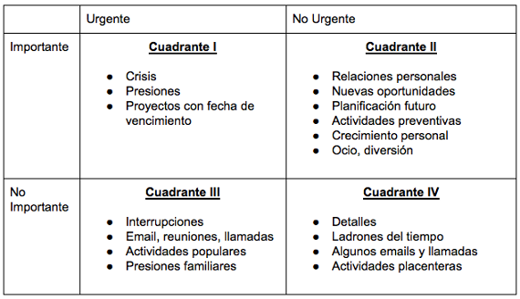

> "Es preciso decidir cuáles son las prioridades más altas, y tener el valor de decir «No» a otras cosas, con buena educación, sonriendo, y sin dar excusas." - Stephen Covey.

Hoy dije no, a una oportunidad interesante y buena para mi  a la cual inicialmente dije que si.

_¿Por qué?_

Porque me di cuenta que no era _lo más importante_ de acuerdo a mis prioridades, a mis metas, mi visión y misión.

Y recapacite de algo simple que he estado omitiendo las semanas anteriores de mi vida: **no todo lo que quiero hacer cabe en la agenda.**

Hace falta decir no conscientemente a cosas que me (y te) apetecen hacer para tener una agenda que funcione.

Y si no lo haces y dejarás que las cosas "fluyan"...

## Ten presente que uno siempre le está diciendo «No» a algo

¿Tu economía no progresa? 

Seguramente en esas horas donde le dijiste SI a la fiesta/rumba/carrete le dijiste NO al desarrollo de habilidades y conocimientos de ventas, presupuesto, productividad, empresa y aportación valor, inversión y ahorro que tú y yo debiamos haber desarrollado hace 3 años atrás.

¿No tienes un amigo con quien compartir?

Seguramente le dijiste que SI demasiado a la soledad, amigo introvertido y dijiste no a impulsar esa conversación con la persona que queria conocerte, invitar al parque al que querias ir con mucha gente.

Es inevitable decir no por acción o por omisión, lo que puedes controlar es decir no a lo que importa menos para decir si a lo que importa más.

## Mira tu agenda con respeto divino.

>  Incluso cuando lo urgente es bueno, lo bueno, si lo permitimos, puede es tar apartándonos de lo que para nosotros es lo mejor, de nuestra contribución singular. - Stephen Covey.

Yo, personalmente, estoy empezando a ver [la agenda](/la-agenda-el-recurso-mas-importante/) con respeto.

Las cosas a las que les digas si en tu semana marcarán tu año, tus próximos 10 años y la vida que viviste. 

¿Lo estás tomando con la responsabilidad que merece? 

¿No te da miedo desperdiciar un dia de tu vida?

## Necesito que compartamos conceptos.

¿Has visto antes la matriz de administración del tiempo que te muestro en la imagen?

Tengo la sensación que si pero por recordate sobre lo que ves:
- El cuadrante I es lo importante y urgente: tu mamá está en el hospital
- El cuadrante II es lo importante y no urgente: aprender esa nueva habilidad para tu profesión.
- El cuadrante III es lo no importante y urgente: proyectos desalineados con tus principios, reuniones que no aportan, interrupciones.
- El cuadrante IV es lo no importante y no urgente: actividades de escape, lectura ociosa, redes sociales ociosas, minucias.

Con eso como contexto volvamos a la crucialidad de decir no.

## Negocia un No por un Si cuando sea necesario.
>«Stephen, para hacer bien las tareas que quieres que se hagan necesitaré varios días. ¿Cuál de estos proyectos preferirías que demore o cancele para satisfacer tu demanda?». - Stephen Covey.

> Cotidianamente decimos «Sí» o «No» a ciertas cosas, por lo general muchas veces al día. Un centro de principios correctos y un objetivo en nuestra misión personal nos otorgan sabiduría para emitir juicios con efectividad en esos casos.- Stephen Covey.

## Si no sabes lo que quieres pierdes

> Es casi imposible decir «No» a la popularidad del cuadrante III, o al placer de huir al cuadrante IV cuando no se tiene un «Sí» más grande ardiendo adentro. - Stephen Covey 

Si no sabes y valoras lo que quieres es dificil que digas sí a alguna visión de vida propia.

## El llamado a la acción.

De todo esto que comento las decisiones y acciones a las que quiero que tú y yo nos comprometamos son las siguientes:

1. Jamás permitas que por consideración con otras personas te permita invertir tu tiempo en cosas que te alejan de tu visión de vida, tus metas, niegate de forma cordial y valiente a participar.

2. Recuerda que si no sabes lo que tú quieres y le dices SI a eso, otros te usarán y harán que le digas NO a tu visión de vida.

3. Vive cada semana pensando en que tu tiempo es escaso, necesitas decir si solo a las prioridades altisimas.